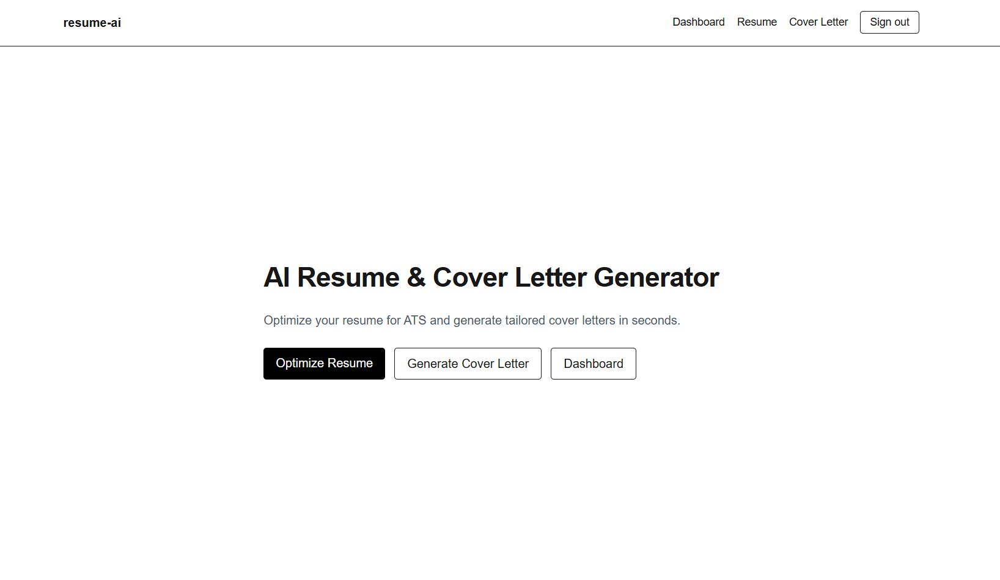
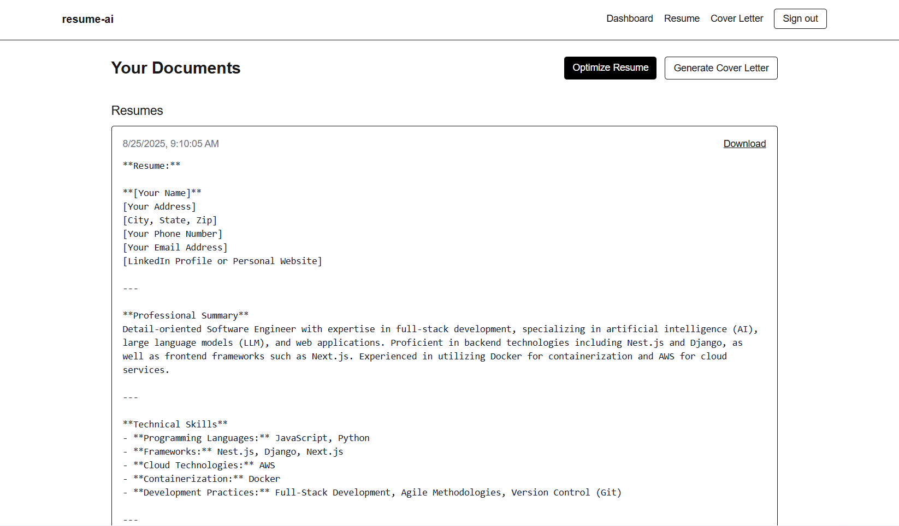
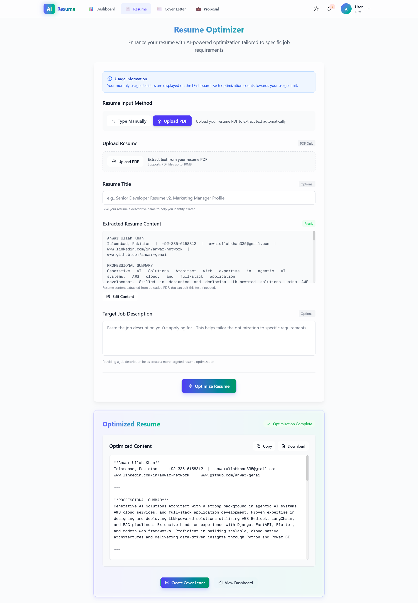
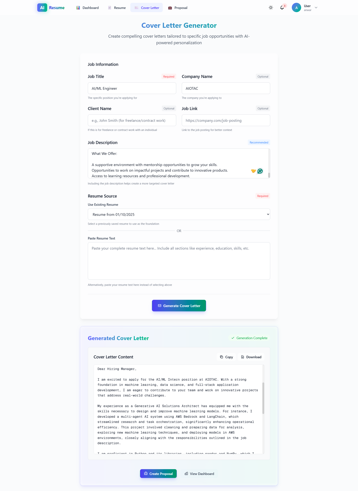
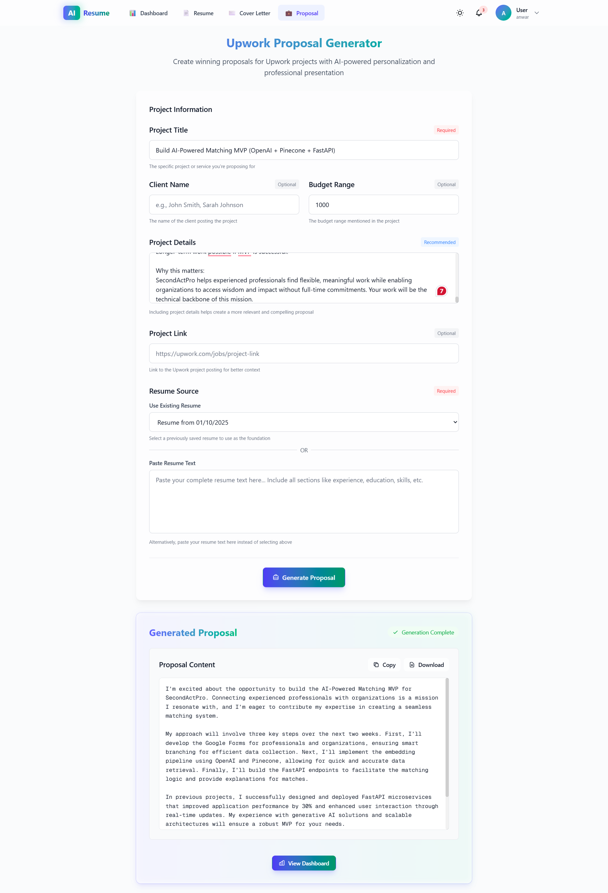

## resume-ai

AI-powered career-document platform that optimizes resumes, generates tailored cover letters, and writes Upwork proposals. Built with Next.js 15 (App Router), TypeScript, TailwindCSS, Prisma (PostgreSQL), NextAuth, OpenAI, and Resend.

### Demo
Below are feature demos placed alongside their respective routes/flows.

**Home view (/)**


**Dashboard (/dashboard)**


**Resume Optimizer (/resume)**


**Cover Letter (/cover-letter)**


**Proposal (/upwork-proposal)**


### Features

- **Authentication**: Email/password via NextAuth (Credentials + Prisma adapter, bcrypt hashing)
- **Email verification & password reset**: Token-based flows delivered via Resend (verify email, forgot/reset password)
- **Resume optimization**: ATS-focused improvements using OpenAI
- **Cover letter generation**: Tailored to job title, company, and a pasted job description
- **Upwork proposal generation**: Tailored to project title, client, budget, and project details
- **PDF upload & parsing**: Upload an existing resume (PDF) and extract its text via `pdf-parse` / `pdfjs-dist`
- **PDF & text export**: Download any generated document as PDF (`jspdf` + `html2canvas`) or plain text
- **Subscription billing (Polar)**: Free / Pro / Power tiers via a Polar.sh checkout + customer portal; webhooks keep the plan in sync (see [Billing & Plans](#billing--plans-polar))
- **Usage control**: Plan-driven **weekly** allowances per document type (resume / cover / proposal) plus a per-day safety cap; account blocking
- **Rate limiting (Upstash)**: Per-IP throttling on login, register, and password-reset to stop brute force / abuse (see [Rate Limiting](#rate-limiting-upstash))
- **Admin tools**: User-management API for stats and blocking abusive accounts
- **Storage**: Resumes, cover letters, and proposals saved in PostgreSQL via Prisma
- **Dashboard**: View, preview, and download previous outputs
- **Polished UI**: TailwindCSS with glassmorphism components, animated background, theme toggle, and page transitions

### Tech Stack

- **Frontend**: Next.js 15 (App Router, Turbopack), React 19, TypeScript, TailwindCSS v4
- **Auth**: NextAuth (Credentials provider, Prisma adapter, JWT sessions)
- **Database**: PostgreSQL + Prisma ORM
- **AI**: OpenAI Chat Completions API (default model: `gpt-4o-mini`)
- **Email**: Resend
- **Billing**: Polar.sh (Merchant of Record) — `@polar-sh/sdk`
- **Rate limiting**: Upstash Redis — `@upstash/ratelimit`, `@upstash/redis`
- **PDF**: `pdf-parse`, `pdfjs-dist` (parsing), `jspdf`, `html2canvas` (export)

### Prerequisites

- Node.js 18+
- PostgreSQL database
- OpenAI API key
- Resend API key (for verification / password-reset emails)
- Polar.sh account + product(s) — for subscription billing (optional for local dev)
- Upstash Redis database — for rate limiting (optional; disabled when unset)

### Quick Start

1) Copy environment variables template

```bash
# macOS/Linux
cp app/env.example .env.local

# Windows (PowerShell)
Copy-Item app/env.example .env.local
```

2) Fill required env vars (see [Environment Variables](#environment-variables) below). Note: `DATABASE_URL` must also be present in a root `.env` file so the Prisma CLI can read it during migrations.

3) Install dependencies and apply migrations

```bash
npm i
npx prisma migrate deploy   # applies existing migrations
npx prisma generate
```

> Use `migrate deploy` against an existing migration history. Use `npx prisma migrate dev` only when authoring new schema changes.

4) Start the dev server

```bash
npm run dev
```

### Main Routes

- `/` — Landing page
- `/register`, `/login` — Authentication (email/password)
- `/auth/verify-email` — Email verification
- `/auth/forgot-password`, `/auth/reset-password` — Password reset
- `/pricing` — Plan comparison (Free / Pro / Power) with upgrade buttons
- `/settings` — Account settings: export your data, delete your account
- `/privacy` — Privacy policy
- `/dashboard` — Saved resumes, cover letters, and proposals
- `/resume` — Paste or upload, then optimize resume text
- `/cover-letter` — Generate tailored cover letters
- `/upwork-proposal` — Generate tailored Upwork proposals

### API Endpoints

**Auth**
- `POST /api/register` — Register user (rate limited)
- `POST /api/auth/login-precheck` — Per-IP login rate check called before sign-in
- `POST /api/auth/send-verification` — Send verification email
- `GET  /api/auth/verify-email` — Verify email via token
- `POST /api/auth/forgot-password` — Request password-reset email (rate limited)
- `POST /api/auth/reset-password` — Reset password via token

**Generation**
- `POST /api/generate-resume` — Optimize resume using OpenAI
- `POST /api/generate-cover` — Generate cover letter using OpenAI (uses a pasted job description)
- `POST /api/generate-proposal` — Generate Upwork proposal using OpenAI (uses pasted project details)
- `POST /api/upload-resume` — Upload a PDF and extract resume text

**Billing (Polar)**
- `GET  /api/checkout?plan=pro|power` — Create a Polar checkout for the chosen plan and redirect
- `GET  /api/portal` — Redirect to the Polar customer portal (manage / cancel / switch plan)
- `POST /api/webhooks/polar` — Polar webhook (signature-verified); syncs plan on payment/cancel/revoke

**Documents & export**
- `GET /api/resumes` — List the current user's resumes
- `GET /api/user/documents` — List the current user's documents
- `GET /api/user/usage` — Current usage and limits
- `GET /api/user/export` — Download all of the user's data as JSON
- `DELETE /api/user/account` — Permanently delete the account + data (blocked while a subscription is active)
- `GET /api/preview/:type/:id` — Preview a document (resume | cover | proposal)
- `GET /api/export/resume/:id` — Download resume
- `GET /api/export/cover/:id` — Download cover letter
- `GET /api/export/proposal/:id` — Download proposal

**Admin**
- `GET|POST /api/admin/user-management` — User stats; block / unblock accounts (admin only)

### Billing & Plans (Polar)

Monetized through a **Polar.sh** checkout. Polar is a **Merchant of Record**, which is why it's used instead of Stripe (the operator is in Pakistan, where Stripe isn't available; Polar handles tax/payout).

**Plans** (limits are plan-driven, defined in `lib/plans.ts`; each document type has its own allowance):

| Plan  | Price   | Resumes / wk | Cover letters / wk | Proposals / wk | Daily cap (each) |
|-------|---------|--------------|--------------------|----------------|------------------|
| Free  | $0      | 3            | 3                  | 3              | 3                |
| Pro   | $5/mo   | 25           | 25                 | 25             | 10               |
| Power | $12/mo  | 100          | 100                | 100            | 25               |

Allowances reset on a **rolling 7-day window**; the daily cap is a safety limit so a single subscriber can't run up the OpenAI bill. On `gpt-4o-mini`, cost per generation is ~$0.001–0.0015, so the limits are positioning/abuse guards, not cost controls.

**Flow:** `/pricing` → `GET /api/checkout?plan=…` (sets `externalCustomerId = userId` + `metadata`) → Polar hosted checkout → `POST /api/webhooks/polar` updates the user's plan → UI reflects it. Manage/cancel/switch happens in the Polar customer portal via `GET /api/portal`.

**Webhook handlers** (signature-verified with `POLAR_WEBHOOK_SECRET`):
- `order.paid` → upgrade to the purchased plan + reset allowance (**primary trigger** — always arrives and carries the customer mapping). Plan is resolved from the **product id**, not hardcoded.
- `subscription.canceled` / `subscription.updated` (with `cancelAtPeriodEnd`) → keep the plan until period end and record `subscriptionEndsAt` (drives the "ends on …" banner).
- `subscription.revoked` → downgrade to Free.

**Polar dashboard setup**
1. Create one **recurring** product per paid plan (Pro, Power), in the **same org/environment** as your access token.
2. Put the product ids in `POLAR_PRODUCT_ID_PRO` / `POLAR_PRODUCT_ID_POWER` (the legacy single `POLAR_PRODUCT_ID` is still honoured as Pro).
3. Add the webhook endpoint `…/api/webhooks/polar` (Format: **Raw**) and copy its secret to `POLAR_WEBHOOK_SECRET`. For local testing expose the route with a tunnel (e.g. `ngrok http 3000`).
4. Token, product, and webhook must all match `POLAR_SERVER` (`sandbox` | `production`) — a prod token against the sandbox API (or vice-versa) returns 401. Sandbox test card: `4242 4242 4242 4242`.

**Decisions / notes**
- **Free trial:** left **off** — the Free tier already serves the top-of-funnel, and a card-required trial changes webhook timing (no `order.paid` during a trial).
- **Automated benefits:** not used — entitlement is driven by our own webhook → DB `plan` field, not Polar benefits.
- **Product metadata:** optional — plan is resolved by product id, so adding a `planId` metadata is belt-and-suspenders only.
- **Checkout page content** (description/image) is configured in the Polar dashboard; no code change.
- **Returning to the app:** after payment, Polar redirects to the checkout's `successUrl` (`/dashboard?upgraded=1`). The hosted checkout has no built-in "back to site" button for *abandonment* — browser-back is the norm for MoR checkouts.

### Rate Limiting (Upstash)

Abuse-prone, mostly-unauthenticated endpoints are throttled per client IP using **Upstash Redis** (`@upstash/ratelimit`). Redis is used (not in-memory) so the limit is shared across serverless instances on Vercel.

| Endpoint | Limit | Notes |
|----------|-------|-------|
| Login (`/api/auth/login-precheck`) | 8 / min / IP | Surfaces a clear "too many attempts" message; `authorize()` keeps a generous 20/min backstop so the cap can't be bypassed by calling the NextAuth callback directly |
| Register (`/api/register`) | 5 / hour / IP | Stops mass free-tier account creation |
| Forgot-password (`/api/auth/forgot-password`) | 4 / hour / IP | Stops password-reset email bombing |

- Works the same locally and on Vercel — Upstash is reached over HTTPS REST, so no hosting/domain is required.
- **If `UPSTASH_*` env vars are unset, rate limiting is a no-op** (the app still runs — handy for local dev).
- Locally there's no proxy, so all requests share the IP `::1` (one bucket). In production the real client IP comes from `x-forwarded-for`.
- Use the **REST** credentials from Upstash (`https://…upstash.io` URL + REST token), not the `redis://` connection string.

> Note: cover-letter and proposal generation take a **pasted** job/project description, not a URL. A previous "paste a job link" feature was removed — server-side fetching is blocked or login-walled on Upwork/LinkedIn (so it silently degraded output) and was an SSRF risk.

### Environment Variables

```
# Database
DATABASE_URL           # PostgreSQL connection string (URL-encode special chars in password)

# App URLs
NEXT_PUBLIC_APP_URL    # e.g. http://localhost:3000
NEXTAUTH_URL           # e.g. http://localhost:3000
NEXTAUTH_SECRET        # 32-byte base64 string

# OpenAI
OPENAI_API_KEY         # Your OpenAI key
OPENAI_MODEL           # Optional (defaults to gpt-4o-mini)

# Email (Resend)
RESEND_API_KEY         # Resend API key
FROM_EMAIL             # e.g. Acme <onboarding@resend.dev>

# Admin
ADMIN_EMAILS           # Comma-separated list of admin emails

# Email verification (optional; gate is ON by default)
# REQUIRE_EMAIL_VERIFICATION=false   # set "false" to disable the verify-to-generate gate

# Billing (Polar) — all from the SAME Polar org/environment
POLAR_SERVER           # sandbox | production
POLAR_ACCESS_TOKEN     # Polar organization access token
POLAR_PRODUCT_ID_PRO   # Recurring product id for the Pro plan
POLAR_PRODUCT_ID_POWER # Recurring product id for the Power plan
POLAR_WEBHOOK_SECRET   # Secret from the Polar webhook endpoint

# Rate limiting (Upstash Redis) — optional; rate limiting is disabled if unset
UPSTASH_REDIS_REST_URL    # https://<db>.upstash.io  (REST URL, not redis://)
UPSTASH_REDIS_REST_TOKEN  # Upstash REST token
```

Usage limits are plan-driven (`lib/plans.ts`) and are no longer configured via env vars.

Tip: Generate a secret on any platform

```bash
node -e "console.log(require('crypto').randomBytes(32).toString('base64'))"
```

### Development Notes

- Prisma client is auto-generated on install via the `postinstall` script.
- Credentials sign-in uses the JWT session strategy.
- Secure API routes rely on `getServerSession`.
- Usage limits are plan-driven in `lib/plans.ts` and enforced (weekly + daily) in `lib/usage.ts`.
- Billing/plan sync lives in `lib/polar.ts` and `app/api/webhooks/polar`; rate limiting in `lib/ratelimit.ts`.
- Login does a dummy bcrypt compare on the no-user path so timing doesn't reveal whether an email is registered; the password-reset link is built from a trusted base URL (not the request `Host`) to prevent host-header injection.
- Email delivery and token generation live in `lib/email.ts` and `lib/tokens.ts`.

### Project Structure

```
app/
  api/
    admin/user-management/route.ts
    auth/[...nextauth]/route.ts
    auth/login-precheck/route.ts
    auth/{send-verification,verify-email,forgot-password,reset-password}/route.ts
    generate-resume/route.ts
    generate-cover/route.ts
    generate-proposal/route.ts
    upload-resume/route.ts
    resumes/route.ts
    user/{documents,usage}/route.ts
    preview/[type]/[id]/route.ts
    export/{resume,cover,proposal}/[id]/route.ts
    register/route.ts
    checkout/route.ts          # Polar checkout
    portal/route.ts            # Polar customer portal
    webhooks/polar/route.ts    # Polar webhook (plan sync)
  auth/{verify-email,forgot-password,reset-password}/page.tsx
  dashboard/page.tsx
  pricing/page.tsx
  resume/page.tsx
  cover-letter/page.tsx
  upwork-proposal/page.tsx
  components/            # Navbar, UsageDisplay, DocumentPreview, UI primitives, etc.
lib/
  auth.ts  db.ts  email.ts  middleware.ts  pdf-generator.ts  tokens.ts  usage.ts
  plans.ts  polar.ts  ratelimit.ts
prisma/
  schema.prisma
  migrations/
```

### Data Model (Prisma)

- **User** — credentials, email verification, blocking flags; plan + Polar fields (`plan`, `polarCustomerId`, `polarSubscriptionId`, `subscriptionStatus`, `subscriptionEndsAt`); weekly counters (`resume/cover/proposalCount`, `currentPeriodStart`) and daily counters (`dailyResume/Cover/ProposalCount`, `currentDayStart`)
- **Account / Session / VerificationToken** — NextAuth models
- **Resume** — original + optimized content
- **CoverLetter** — job title, company, optional job description
- **Proposal** — project title, client, budget, project details

### License

MIT
